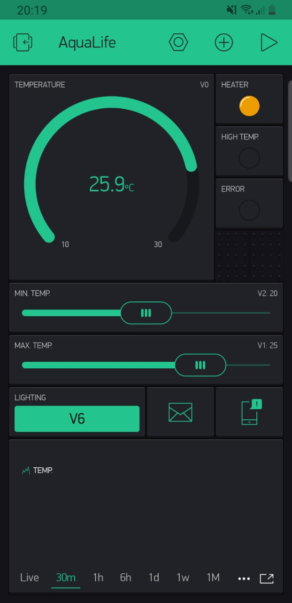
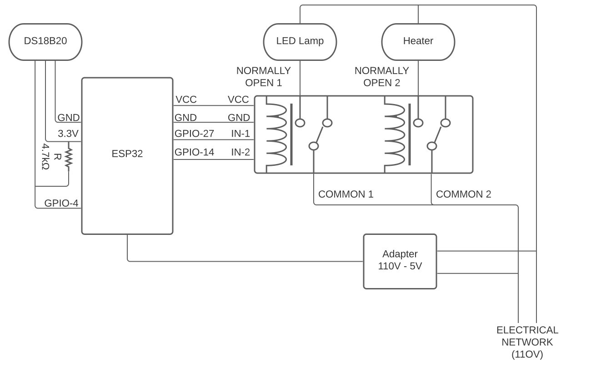

# Aquarium Controller

The aim of this project is to offer a low-cost aquarium controller, capable of maintaining the water at an acceptable temperature range and controlling the lighting.

The assembling requires cheap components and the user interface is made through the `Android` or `iOS` [Blynk](https://www.blynk.cc/) app.

## List of components

- Microcontroller `ESP32`. _(The model used was the DOIT Esp32 DevKit v1)_
- Waterproof thermometer `DS18B20`.
- 2 Relays. _(5V-DC to 110V-AC)_
- Aquarium heater. _(Any 110V-AC heater. The one used was a 2.5W model.)_
- 4.7 kOhm resistor
- Jumper cables.

## App Setup

1. Install the Blynk app on an Android or iOS device.
2. Create a new project
3. Add the desired UI components _(recommended layout below)_
<table>
  <td>
    
  </td>
  <td>

| Component                 | Virtual Pin |
| ------------------------- | ----------- |
| Temperature Gauge Display | V0          |
| Max. Temperature Slider   | V1          |
| Min. Temperature Slider   | V2          |
| Error LED                 | V3          |
| High Temp. LED            | V4          |
| Error LED                 | V5          |
| Lighting Button           | V6          |

  </td>
</table>

## Schematic



## Uploading the Code to ESP32

The usage of the Arduino IDE is recommended.

The first step is to install the [support to the ESP32 family in Arduino IDE](https://github.com/espressif/arduino-esp32) and select it.

1. Open **FILE > PREFERENCES**.
2. Add `https://dl.espressif.com/dl/package_esp32_index.json` to **Additional Boards Manager URLs**.
3. Open **TOOLS > BOARD > BOARD MANAGERS**.
4. Search for `esp32`.
5. Install `Espressif Systems version 1.0.4`.
6. Connect the ESP32 to the computer, using an USB cable.
7. In `TOOLS > BOARD > ESP32 ARDUINO` select your model. _(DOIT ESP32 DEVKIT V1)_
8. In `TOOLS > PORT` select the USB port used.

Now, add the libraries from _OneWire_, _DallasTemperature_ and _Blynk_.

1. Open **SKETCH > INCLUDE LIBRARY > MANAGE LIBRARIES**.
2. Search for `OneWire`.
3. Install `OneWire` version 2.3.5, by Jim Studt et al.
4. Search for `DallasTemperature`.
5. Install `DallasTemperature` version 3.9.0, by Miles Burton et al.
6. Search for `Blynk`.
7. Install `Blynk` version 0.6.1, by Volodymyr Shymanskyy.

Open `Aquarium-Controller.ino` in Arduino IDE. Insert the missing values at the start.

```
#define BLYNK_AUTH_TOKEN "<BLYNK_AUTH_TOKEN_HERE>"
#define WIFI_SSID "<WIFI_SSID_HERE>"
#define WIFI_PASSWORD "<WIFI_PASSWORD_HERE>"
```

> The Blynk token is generated when a new project is created in the Blynk app.

Finally, compile and upload the code to your ESP32.
